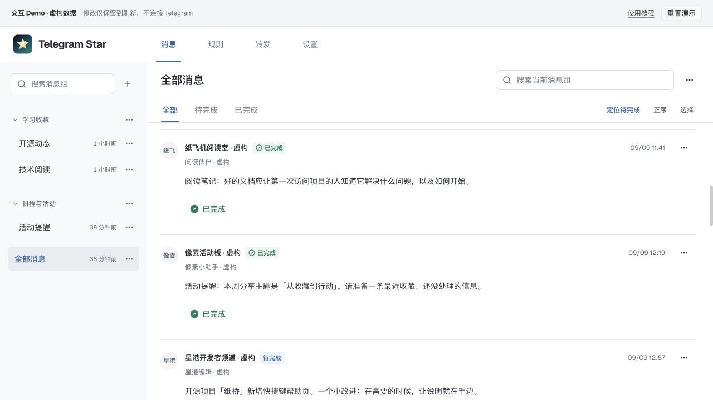

# 交互 Demo

Demo 复用 Telegram Star 的四个工作区，用虚构消息、规则和转发通道演示交互。无需 Telegram 账号、API 凭据、后端或 SQLite，所有操作只发生在浏览器中。



## 本地体验

在仓库根目录，使用 Node.js 24 和 pnpm 11.9.0：

```bash
pnpm install --frozen-lockfile
pnpm dev:demo
```

打开 [http://localhost:5173](http://localhost:5173)。它和普通 Web 开发共用 5173 端口，已有 Web 开发服务时先停止该服务，或使用以下独立预览端口：

```bash
pnpm build:demo
pnpm preview:demo
```

打开 [http://localhost:4173](http://localhost:4173)。不需要创建 `.env`，也不要给演示版本填写真实凭据。

## 两分钟体验路线

1. **消息**：打开一个消息组，在消息列表内搜索关键词，再清空搜索。将一条消息标记完成，切换完成状态筛选观察变化。
2. **规则**：选择已有规则，查看来源和条件组。可以编辑、保存或新建规则，了解关键词、并且、排除的配置方式。
3. **转发**：查看示例通道，切换「接收规则 / 消息格式」，试试格式预设和模板变量。
4. **设置**：查看 Telegram、媒体与设备分类。真实连接和凭据保存会提示需要部署自己的实例。
5. 点击顶部「重置演示」或刷新，恢复初始虚构数据。

手机窄屏下先显示列表，点击条目进入详情；底部导航切换工作区。

## 功能边界

| 功能 | Demo 行为 |
| --- | --- |
| 消息列表、搜索、按规则 / 完成状态筛选 | 使用固定虚构消息 |
| 单条 / 批量完成 | 修改页面内存，刷新恢复 |
| 规则、消息组、转发通道编辑 | 在页面内存保存，不影响其他访客 |
| 新规则收录消息、保存后历史重算 | 不运行真实匹配引擎，已有消息只是预置展示数据 |
| Telegram 登录、退出、服务器连接、凭据保存 | 不执行真实连接，受限制的操作显示解释 |
| 匹配样本扫描、补录历史、通知发送测试 | 不执行，显示 Demo 不支持的提示 |
| 媒体附件、Telegram 来源头像、实时消息 | 无真实资源或实时数据；头像显示来源文字 |
| 数据持久化 | 不写数据库；刷新重置业务数据，浏览器可保留界面偏好 |

## 发布为静态站

```bash
pnpm build:demo
```

仅上传 **`packages/web/dist-demo/`** 的内容。普通 `packages/web/dist/` 会调用真实后端，不能替代 Demo 产物。

Demo 使用相对资源路径及 Hash 路由，例如 `/#/messages` 或 `/telegram-star/#/messages`，适用于静态托管和仓库子路径，无需服务器配置 SPA 路由重写。

### GitHub Pages

仓库提供[手动发布工作流](../.github/workflows/demo-pages.yml)：

1. 将代码推送到仓库默认分支。
2. 在 GitHub 仓库 **Settings → Pages → Build and deployment → Source** 选择 **GitHub Actions**。
3. 在 **Actions → Publish Demo → Run workflow** 从 `main` 手动运行。
4. 成功后打开工作流部署环境给出的页面地址，检查四个 Tab，再把该地址加到 README 和仓库 About 的 Website。

工作流只构建和上传静态 Demo，无需 Telegram 或 SSH Secrets，不启动生产服务。当前仅准备了配置，是否已上线以 GitHub 的实际部署结果为准。官方配置说明见 [GitHub Pages 自定义工作流](https://docs.github.com/en/pages/getting-started-with-github-pages/using-custom-workflows-with-github-pages)。

## 隔离方式与维护

- 仅 `vite --mode demo` / `vite build --mode demo` 启用 Demo；URL 参数无法把普通构建切换成 Demo。
- API 请求交给内存适配器，未知接口直接报错，绝不回退真实网络。
- 不建立 SSE、设备心跳、头像请求或 Service Worker；健康检查和服务器地址保存被阻止。
- 静态构建通过 CSP `connect-src 'none'` 再拦截意外 API 请求；开发服务器保留 HMR 所需连接。
- 新增业务接口时同步维护 `packages/web/src/demo/api.ts` 及测试；不要从个人数据库导出 fixture。

录制截图或 GIF 请使用此 Demo，避免包含真实频道、手机号、API Hash、会话、Apprise 地址或通知内容。
